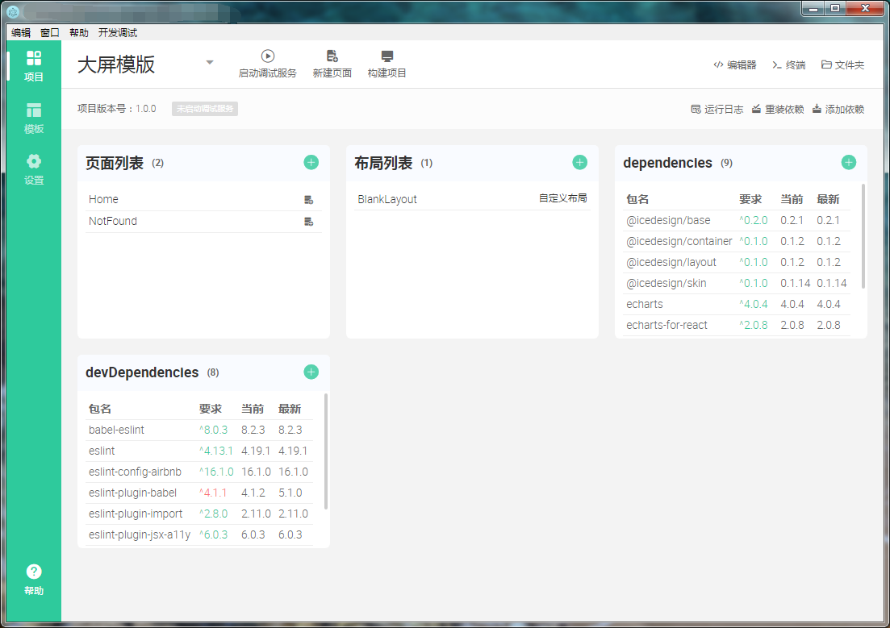

[](https://github.com/alibaba/ice)

# Use-iceWorks

iceworks-desktop编译之后的源代码。

## To Use

To clone and run this repository you'll need [Git](https://git-scm.com) and [Node.js](https://nodejs.org/en/download/) (which comes with [npm](http://npmjs.com)) installed on your computer. From your command line:

```bash
# if your system is window,you need to install these two packages first
npm install electron -g
npm install electron-packager -g

# Clone this repository
git clone -b desktop https://github.com/mowatermelon/Use-iceWorks.git
# Go into the repository
cd Use-iceWorks
# Install dependencies
cnpm i
# Run the app iceworks ipc started at 8000
npm run start
# package win32 application
npm run package:win32
# package win64 application
npm run package:win64
# package linux32 application
npm run package:linux32
# package linux64 application
npm run package:linux64
# package mac application
npm run package:mac
```

# Screenshot





# Skill

> main/windowList.js

```

n.loadURL(i('index'))

// change to

n.loadURL(path.resolve('renderer/index.html'))


t.loadURL(r("updater"))

// change to

t.loadURL(path.resolve('renderer/updater.html'))


t.loadURL(r("about"))

// change to 

t.loadURL(path.resolve('renderer/about.html'))

```

# Q&A

[ask me](https://github.com/mowatermelon/Use-iceWorks/issues/new?labels=iceworks)